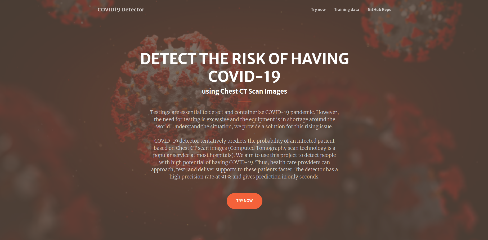

# COVID-19 Detector



COVID-19 detector is a website that uses machine learning to give tentative predictions about an user's probability of contracting COVID-19 by looking at their chest CT-scan.

## How Our Project Aids Health Care Providers
* Help doctors and healthcare workers in diagnosing patients.
* Reduce the load on testing facilities, more testing kits for people who needed it.

## The Tech Stack We Are Using
Backend:
* Flask : A lightweight python web application framework

Frontend:
* Bootstrap 4 : A Javascript web framework

Our machine learning model:
* Trained with Microsoft Azure Custom Vision
* Data set provided by [COVID-CT](https://github.com/UCSD-AI4H/COVID-CT)

## Hosting A Local Instance Of Our Website

1. Clone our repository
2. (Optional) Create a virtual python environment
3. Run ```pip install -r requirements.txt``` inside the project root directory
4. Set up your Azure Custom Vision project and create a `credentials.json` file similar to our `credentials_example.json` file.
5. Run ```flask run```
6. The website should be up and running at `localhost:5000`

## Credits:
+ Data set from [COVID-CT](https://github.com/UCSD-AI4H/COVID-CT)
